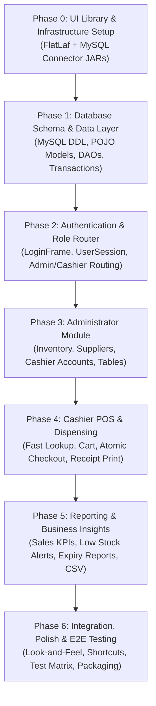

# Pharmacy Inventory Management System (PIMS) — Plan of Approach

## Executive Summary
The **Pharmacy Inventory Management System (PIMS)** is a multi-user, role-based desktop enterprise application built with **Java** and **Java Swing**, designed for pharmaceutical inventory tracking, high-speed point-of-sale (POS) dispensing, and managerial business intelligence. 

Per project requirements, development is structured into **sequential, modular phases**. In alignment with your instructions, we prioritize **individual frontend components and modern UI design libraries** (using **FlatLaf** for clean, modern desktop aesthetics) to ensure every interface is intuitive, responsive, and visually polished before connecting complex backend relational database operations.

---

## 1. Technology Stack & Library Infrastructure

| Layer | Technology | Purpose |
| :--- | :--- | :--- |
| **Language** | Java 26 (SE) | Core language, object-oriented design, thread safety |
| **GUI Framework** | Java Swing + AWT | Native cross-platform desktop user interface |
| **UI Design Library** | **FlatLaf 3.5+** | Commercial-grade modern flat Look & Feel, HiDPI scaling, rounded corners |
| **Database** | MySQL 8.0+ / InnoDB | Relational data persistence, ACID transactions, foreign keys |
| **Connectivity** | MySQL Connector/J | JDBC connection pooling & prepared statement execution |
| **Build Tool** | Apache Ant (NetBeans) | Compilation, dependency linking, executable JAR packaging |
| **Architecture** | Layered MVC | Model - View - DAO - Service - Session separation |

---

## 2. Frontend-First Component Architecture Strategy

Rather than building rigid, monolithic screens, we first construct a **reusable UI component toolkit** (`pharmacyims.ui.common`). These building blocks are assembled into full dashboards during subsequent phases:

```
+-------------------------------------------------------------------------+
|                  REUSABLE UI COMPONENT TOOLKIT                          |
+-------------------+--------------------+--------------------------------+
|  MetricCard       |  CustomSearchField |  StatusBadgeRenderer           |
|  - Icon + Value   |  - Search icon     |  - Green (In Stock)            |
|  - Accent border  |  - Clear button    |  - Orange (Low Stock <= Alert) |
|  - Trend label    |  - Real-time event |  - Red (Out of Stock / Expired)|
+-------------------+--------------------+--------------------------------+
|  SidebarNav       |  ModernHeaderBar   |  BillReceiptDialog             |
|  - Active pill    |  - Current User    |  - Monospace thermal layout    |
|  - Hover state    |  - Live clock      |  - One-click Java Print API    |
|  - Role guard     |  - Logout trigger  |  - Clean margin formatting     |
+-------------------+--------------------+--------------------------------+
```

---

## 3. Database Entity-Relationship Model (ERD)

```mermaid
erDiagram
    USERS ||--o{ SALES : "processes"
    SUPPLIERS ||--o{ MEDICINES : "supplies"
    MEDICINES ||--o{ SALE_ITEMS : "included_in"
    SALES ||--|{ SALE_ITEMS : "contains"

    USERS {
        int user_id PK
        string username UK
        string password
        enum role "Admin, Cashier"
        string full_name
        timestamp created_at
    }

    SUPPLIERS {
        int supplier_id PK
        string name
        string contact_person
        string phone
        string email
        text address
    }

    MEDICINES {
        int medicine_id PK
        string name
        string company
        string medicine_type
        decimal price
        int quantity_in_stock
        int reorder_level
        date expiry_date
        int supplier_id FK
    }

    SALES {
        int sale_id PK
        timestamp sale_date
        decimal total_amount
        decimal amount_paid
        decimal change_given
        int user_id FK
    }

    SALE_ITEMS {
        int sale_item_id PK
        int sale_id FK
        int medicine_id FK
        int quantity_sold
        decimal price_at_sale
        decimal subtotal
    }
```



---

## 4. Master Phased Development Roadmap



### Phase 0: Project Infrastructure & UI Library Setup
* Create `lib/` directory in project root.
* Add **`flatlaf-3.5.4.jar`** and **`mysql-connector-j-26.7.0.jar`**.
* Configure NetBeans `project.properties` classpath.
* Verify clean compilation with Ant.

### Phase 1: Database Schema & Core Data Access Layer
* Execute relational DDL in MySQL (`pims_db`).
* Populate development seed data (Admin, Cashiers, Suppliers, Medicines).
* Implement `util.DBConnection` (thread-safe connection provider).
* Implement POJO models (`User`, `Supplier`, `Medicine`, `Sale`, `SaleItem`).
* Implement DAOs (`UserDAO`, `SupplierDAO`, `MedicineDAO`, `SaleDAO`).
* Detailed specification: [`docs/PHASE_1_DATABASE_AND_DATA_LAYER.md`](file:///home/michael/NetBeansProjects/pharmacyIMS/docs/PHASE_1_DATABASE_AND_DATA_LAYER.md).

### Phase 2: Authentication & Role Redirection Module
* Design modern two-panel `LoginFrame` with FlatLaf styling.
* Implement `session.UserSession` context holder.
* Implement role-based navigation router:
  * `Admin` $\rightarrow$ `AdminDashboard`
  * `Cashier` $\rightarrow$ `CashierDashboard`
* Detailed specification: [`docs/PHASE_2_AUTHENTICATION_MODULE.md`](file:///home/michael/NetBeansProjects/pharmacyIMS/docs/PHASE_2_AUTHENTICATION_MODULE.md).

### Phase 3: Administrator Module (Inventory, Suppliers & Users)
* Construct `AdminDashboard` with sidebar navigation and top header.
* **Medicine Management Tab**: Live search, category filter, custom badge renderers (`In Stock`, `Low Stock`, `Expired`), Add/Edit modal dialogs.
* **Supplier Management Tab**: Vendor directory table, contact editor dialog.
* **User Management Tab**: Cashier account creation, password reset, role protection.
* Detailed specification: [`docs/PHASE_3_ADMIN_MODULE.md`](file:///home/michael/NetBeansProjects/pharmacyIMS/docs/PHASE_3_ADMIN_MODULE.md).

### Phase 4: Cashier Module (POS, Stock Lookup & Billing)
* Construct `CashierDashboard` tailored for high-speed dispensing.
* Quick product search & real-time stock verification card.
* Interactive cart table with quantity modifiers and auto-subtotals.
* Atomic transaction checkout via `SaleDAO.processSale()`:
  * Generates sale header $\rightarrow$ inserts sale items $\rightarrow$ decrements medicine stock atomically.
* Formatted receipt dialog (`BillReceiptDialog`) with instant physical printing support.
* Detailed specification: [`docs/PHASE_4_CASHIER_MODULE.md`](file:///home/michael/NetBeansProjects/pharmacyIMS/docs/PHASE_4_CASHIER_MODULE.md).

### Phase 5: Reporting & Analytics Module
* Construct `ReportsPanel` embedded into `AdminDashboard`.
* **Sales Revenue Stream**: Filter by Today, 7 Days, Month, Custom range; summary KPIs.
* **Low Stock / Reorder Stream**: Surface stock $\le$ reorder level with supplier contact phone.
* **Expiry Date Stream**: Flag critical medications expiring in $\le 30$ days.
* CSV export and tabular print report utilities.
* Detailed specification: [`docs/PHASE_5_REPORTING_MODULE.md`](file:///home/michael/NetBeansProjects/pharmacyIMS/docs/PHASE_5_REPORTING_MODULE.md).

### Phase 6: System Integration, UI Polish & Final Testing
* Unified FlatLaf styling, global keyboard shortcuts (F2 Add, F5 Checkout, Esc Cancel).
* Window close confirmation and session logout safeguards.
* Complete 18-point verification test matrix execution.
* Ant build packaging into standalone `dist/pharmacyIMS.jar`.
* Detailed specification: [`docs/PHASE_6_INTEGRATION_AND_TESTING.md`](file:///home/michael/NetBeansProjects/pharmacyIMS/docs/PHASE_6_INTEGRATION_AND_TESTING.md).

---

## 5. Role-Based Access Control (RBAC) Matrix

| Feature / Screen | Admin | Cashier | Notes |
| :--- | :---: | :---: | :--- |
| **Authentication & Session** | Yes | Yes | Distinct dashboard routing |
| **Inventory View** | Yes | Yes | Cashier view is read-only stock lookup |
| **Add / Edit / Delete Medicines** | Yes | **No** | Enforced by UI and DAO |
| **Adjust Medicine Prices** | Yes | **No** | Admin restricted |
| **Supplier Directory & Management** | Yes | **No** | Admin restricted |
| **Manage User Accounts** | Yes | **No** | Admin restricted |
| **Dispense Medicine / Active Cart** | Yes | Yes | Cashier primary screen |
| **Process Checkout & Print Bill** | Yes | Yes | Atomic stock reduction |
| **Access Financial & Expiry Reports** | Yes | **No** | Admin restricted |
| **Export Data to CSV** | Yes | **No** | Admin restricted |

---

## 6. Directory Structure Reference

```
/home/michael/NetBeansProjects/pharmacyIMS/
├── build.xml
├── manifest.mf
├── PLAN_OF_APPROACH.md                      ← Master Roadmap & Architecture
├── docs/                                    ← Detailed Phase Guides
│   ├── PHASE_1_DATABASE_AND_DATA_LAYER.md
│   ├── PHASE_2_AUTHENTICATION_MODULE.md
│   ├── PHASE_3_ADMIN_MODULE.md
│   ├── PHASE_4_CASHIER_MODULE.md
│   ├── PHASE_5_REPORTING_MODULE.md
│   └── PHASE_6_INTEGRATION_AND_TESTING.md
├── lib/                                     ← External Libraries
│   ├── flatlaf-3.5.4.jar                    ← Modern Swing Look and Feel
│   └── mysql-connector-j-26.7.0.jar         ← MySQL JDBC Driver
├── nbproject/
│   ├── project.properties
│   └── project.xml
└── src/
    └── pharmacyims/
        ├── PharmacyIMS.java                 ← Application Entry Point (Main)
        ├── model/                           ← POJO Entities (User, Medicine, etc.)
        ├── dao/                             ← JDBC Data Access Objects
        ├── session/                         ← UserSession State
        ├── util/                            ← DBConnection, PasswordHasher
        └── ui/
            ├── common/                      ← Reusable UI elements (Buttons, Cards, Badges)
            ├── auth/                        ← LoginFrame
            ├── admin/                       ← AdminDashboard & Form Dialogs
            ├── cashier/                     ← CashierDashboard & POS Controls
            └── reports/                     ← ReportsPanel & CSV Exporter
```
